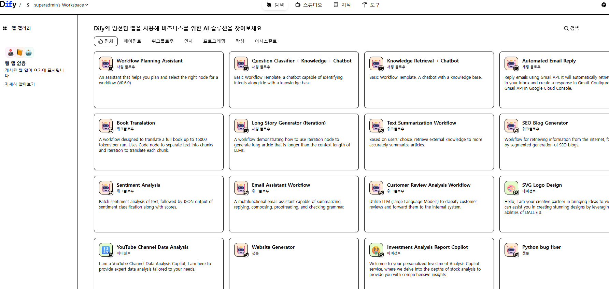
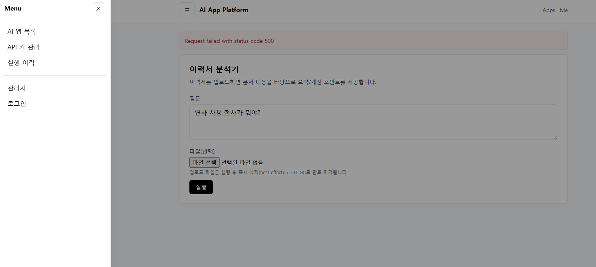

# AI 앱 플랫폼 템플릿 (Dify + Qdrant 엔진 기반)
요구사항(회원/앱카탈로그/실행/키관리/결제/관리자)을 구현하기 위한 **실행 가능한 모노레포 스타터**입니다.

- DB: Postgres
- Backend: Express (CommonJS) + node-postgres
- Frontend: Next.js + Tailwind + OffCanvas(바닐라 JS 토글)
- RAG: Qdrant + Retriever(FastAPI)
- Dify: 백엔드에서 Dify 워크플로우 실행(어댑터 구조)

---

## 1) 빠른 실행
### 0. 환경파일
```bash
cp .env.example .env
# OPENAI_API_KEY는 retriever(임베딩)에 필수
```

### 1. 전체 스택 실행
```bash
docker compose up -d --build
```

### 2. DB 마이그레이션 + 시드
```bash
# 로컬에서 실행 (docker가 아니라 내 PC에서)
npm install
npm run db:migrate
npm run db:seed
```

### 3. 접속
- Web: http://localhost:3000
- API: http://localhost:4000/health
- Qdrant: http://localhost:6333
- Retriever: http://localhost:8088/health

---

## 2) Dify 연동 (옵션)
Dify는 별도로 띄우는 편이 운영상 유리합니다(버전/포트/리버스프록시 영향).  
원하면 `scripts/dify/*`로 Dify를 내려받아 실행할 수 있습니다.

```bash
bash scripts/dify/01_get_dify.sh
bash scripts/dify/02_start_dify.sh
```

---
```
# 1) Dify 전용 env 파일 생성
cat > /home/AI-app-platform-dify-qdrant/vendor/dify/docker/.env <<'ENV'
EXPOSE_NGINX_PORT=8080
EXPOSE_NGINX_SSL_PORT=8443
ENV

# 2) Dify compose를 "프로젝트 디렉터리 + env-file"까지 명시해서 실행 (가장 확실)
docker compose \
  --project-directory /home/AI-app-platform-dify-qdrant/vendor/dify/docker \
  --env-file /home/AI-app-platform-dify-qdrant/vendor/dify/docker/.env \
  -f /home/AI-app-platform-dify-qdrant/vendor/dify/docker/docker-compose.yaml \
  down --remove-orphans

docker compose \
  --project-directory /home/AI-app-platform-dify-qdrant/vendor/dify/docker \
  --env-file /home/AI-app-platform-dify-qdrant/vendor/dify/docker/.env \
  -f /home/AI-app-platform-dify-qdrant/vendor/dify/docker/docker-compose.yaml \
  up -d
```

---
```
docker compose \
  --project-directory /home/AI-app-platform-dify-qdrant/vendor/dify/docker \
  --env-file /home/AI-app-platform-dify-qdrant/vendor/dify/docker/.env \
  -f /home/AI-app-platform-dify-qdrant/vendor/dify/docker/docker-compose.yaml \
  config | grep -nE 'EXPOSE_NGINX|8080:|80:80|443:443|8443:'
```

그리고 `.env`에 아래를 맞춰주세요.
- `DIFY_BASE_URL`
- `DIFY_API_KEY`

> Dify API 경로는 배포/버전에 따라 달라질 수 있어 `apps/api/src/clients/difyClient.js`에 어댑터로 분리해두었습니다.

---

## 3) 개인정보(이력서 등) 즉시 파기 구조
- 업로드 파일은 `uploads/`에 저장되며 DB에 `uploads` 레코드로 추적합니다.
- `POST /api/apps/:id/run` 실행 완료 시 **즉시 삭제(best-effort)** 합니다.
- 추가 안전장치로 `UPLOAD_TTL_MINUTES` 기반 **주기적 GC(백엔드 setInterval)** 로 만료 파일을 강제 파기합니다.
- 파기 내역은 `uploads.destroyed_at`, `destroy_reason`에 남습니다.

---

## 4) 주요 기능(현재 포함된 MVP)
### 사용자
- 회원가입 / 로그인 (JWT access + refresh cookie)
- 내 정보 조회
- 내 API Key 등록/삭제(암호화 저장)

### 앱
- 앱 목록/상세 조회
- 앱 실행(텍스트 + 파일 업로드)
- 실행 로그 저장

### 관리자(간단 RBAC)
- 관리자 사용자: 시드 데이터로 생성(README 하단 참고)
- 앱 카탈로그 등록/수정/삭제

### 결제(PG)
- `POST /api/billing/webhook` 골격만 포함(실 결제사는 추후 선택)

---

## 5) 폴더 구조
```
apps/
  api/           # Express API
  web/           # Next.js + Tailwind + OffCanvas
services/
  qdrant_service # FastAPI Retriever (ingest/search)
scripts/
  dify/          # Dify 다운로드/기동 스크립트
db/
  migrations/    # SQL migrations
```

---

## 6) 시드 계정
- 관리자:
  - email: admin@example.com
  - password: Admin!234
- 일반 사용자:
  - email: user@example.com
  - password: User!2345

---



